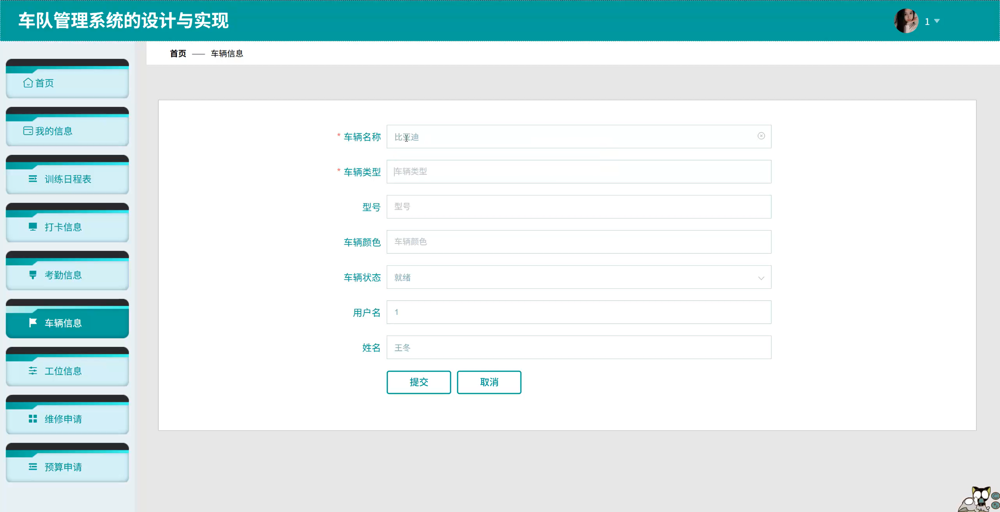
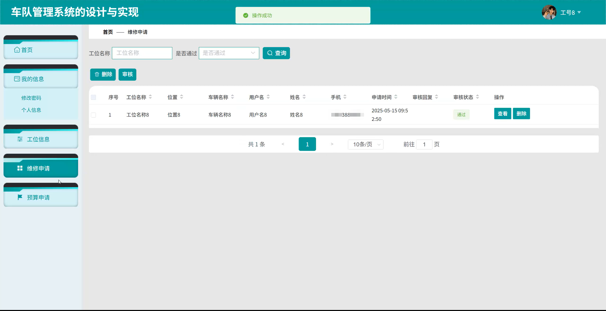
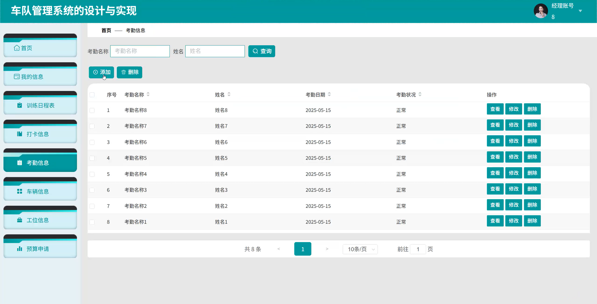
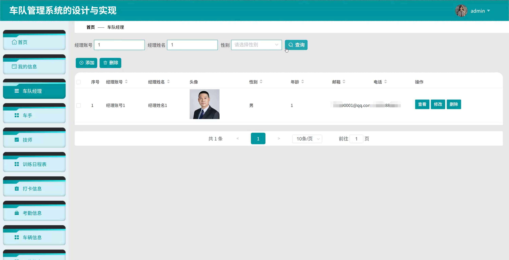
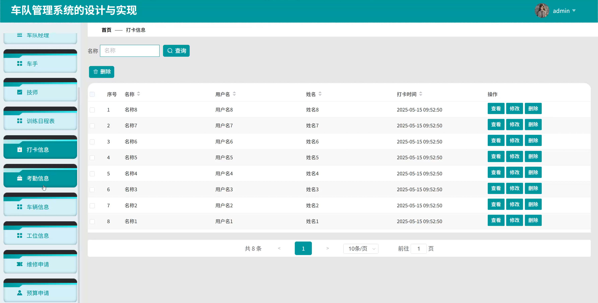
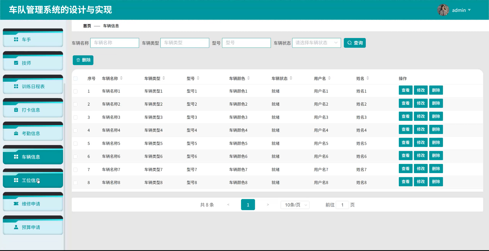
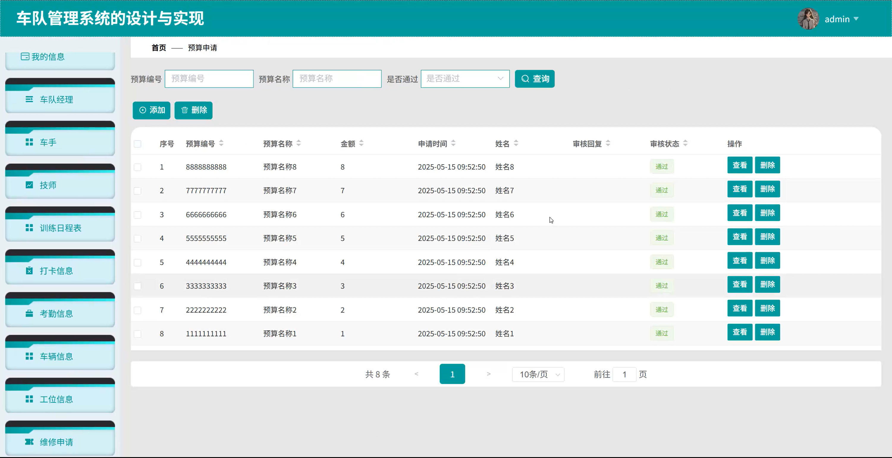

# springbootA424D
springbootA424D车队管理系统+LW
 
## 查看主页获取源码

### 一、关键词
车队考勤信息、车队打卡信息、车队车辆信息

### 二、作品包含
源码+数据库+全套环境和工具资源+本地部署教程

### 三、项目技术
前端技术：Html、Css、Js、Vue2.0、Element-ui 
后端技术：Java、SpringBoot2.0、MyBatis

### 四、运行环境（以下版本亲测，其他版本未知，请自测）
开发工具：IDEA/eclipse  + VSCODE

数据库：MySQL5.7（最低要5.7版本）

数据库管理工具：Navicat10以上版本

环境配置软件： JDK1.8 + Maven3.6.3

前端Nodejs：14

浏览器：谷歌浏览器

### 五、项目介绍
项目编号：springbootA424D

车队管理系统通过为管理员、车队经理、车手、技师等不同角色分配适配的功能权限，实现对车队全流程的规范化管理，提升运营效率与协作效能。

角色：管理员、车队经理、车手、技师

管理员功能：首页、我的信息、车队经理、车手、技师、训练日程表、打卡信息、考勤信息、车辆信息、工位信息、维修申请。

车队经理功能：首页、我的信息、训练日程表、打卡信息、考勤信息、车辆信息、工位信息、预算申请。

车手功能：首页、我的信息、训练日程表、打卡信息、考勤信息、车辆信息、工位信息、维修申请、预算申请。

技师功能：首页、我的信息、工位信息、维修申请、预算申请。

### 六、运行截图

